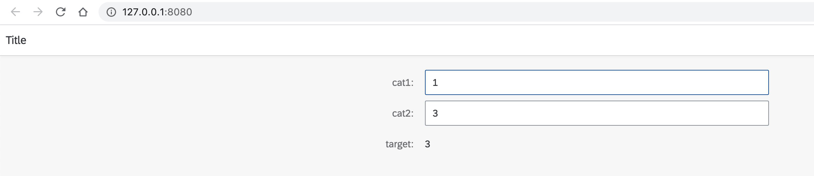

# Client side ML model inference in UI5 

This repo is a prototype of idea for onnx machine learning model inference in OpenUI5 extension. 

## How to run: 
```
npm install --global http-server
```
In directory folder: 
```
http-server
```
This simple application contain 2 input fileds (cat1 and cat2) and automatically calculate target with help of onnx model.
The model is a Neural Network and was trained with help of Pytorch in [ML4UI.ipynb](ML4UI.ipynb)

The data this model based on: 

| Cat1  | Cat2 | Target |
| ----- | ---- | ------ |
|   1   |  3   |   3    |
|   1   |  4   |   1    |
|   2   |  2   |   4    |


